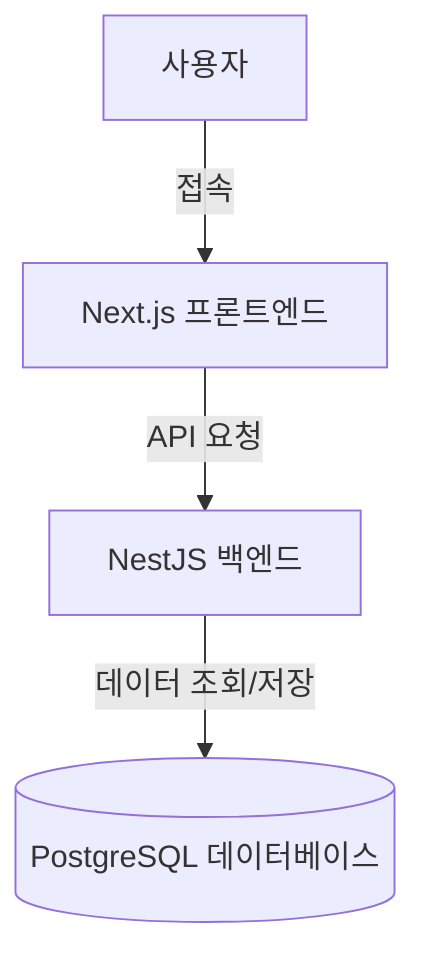

# 쇼핑몰 프로젝트 아키텍처 및 기술 스택

## 목표
아뜨랑스(attrangs.co.kr) 스타일의 쇼핑몰을 직접 구축하며, 실무 수준의 아키텍처와 기술 스택을 학습하고 적용합니다.

## 기술 스택 (Tech Stack)

### 1. 프론트엔드 (Frontend)
- **Next.js 14+ (App Router)**: 최신 React 프레임워크로, SEO 최적화와 빠른 렌더링(SSR/SSG)을 위해 선택했습니다.
- **TypeScript**: 정적 타입 검사를 통해 안정적인 코드 작성을 돕습니다.
- **Vanilla CSS (CSS Modules)**: 스타일 충돌을 방지하고 컴포넌트 단위의 스타일링을 위해 사용합니다.
- **Zustand**: 가볍고 직관적인 전역 상태 관리 라이브러리입니다.

### 2. 백엔드 (Backend)
- **NestJS**: Node.js 기반의 프레임워크로, 모듈화된 아키텍처와 의존성 주입(DI)을 제공하여 유지보수성이 뛰어납니다.
- **TypeScript**: 백엔드 로직의 안정성을 보장합니다.
- **Prisma ORM**: 데이터베이스와의 상호작용을 타입 안전하고 직관적으로 처리합니다.

### 3. 데이터베이스 (Database)
- **PostgreSQL**: 강력한 기능과 안정성을 가진 관계형 데이터베이스(RDBMS)입니다.

### 4. 인프라 (Infrastructure)
- **Docker**: 개발 환경과 배포 환경의 일관성을 위해 컨테이너 기술을 사용합니다.

## 시스템 아키텍처

## 주요 기능 (예정)
1. **회원 관리**: 회원가입, 로그인(JWT), 마이페이지
2. **상품 관리**: 카테고리별 상품 목록, 상품 상세, 검색
3. **주문 관리**: 장바구니, 주문 결제, 주문 내역 확인
4. **관리자 페이지**: 상품 등록/수정, 주문 관리
