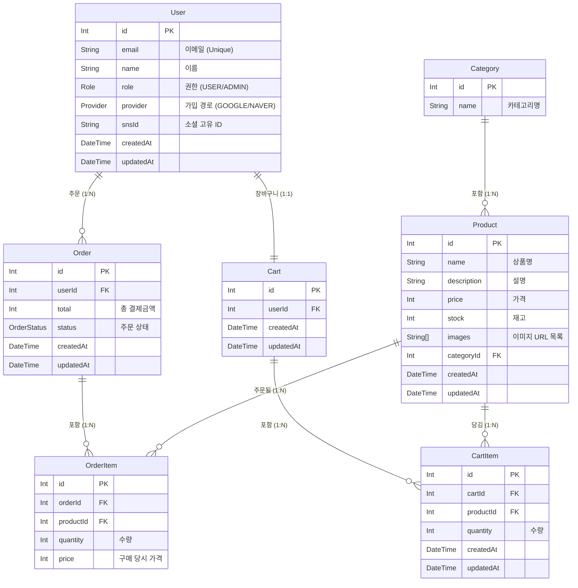

# 쇼핑몰 데이터베이스 ERD

이 문서는 프로젝트의 데이터베이스 스키마 구조를 시각화한 ERD(Entity Relationship Diagram)입니다.

## Enum Types

### Role
- USER: 일반 사용자
- ADMIN: 관리자

### Provider
- GOOGLE: 구글 로그인
- NAVER: 네이버 로그인

### OrderStatus
- PENDING: 결제 대기
- PAID: 결제 완료
- SHIPPED: 배송 중
- DELIVERED: 배송 완료
- CANCELLED: 주문 취소
