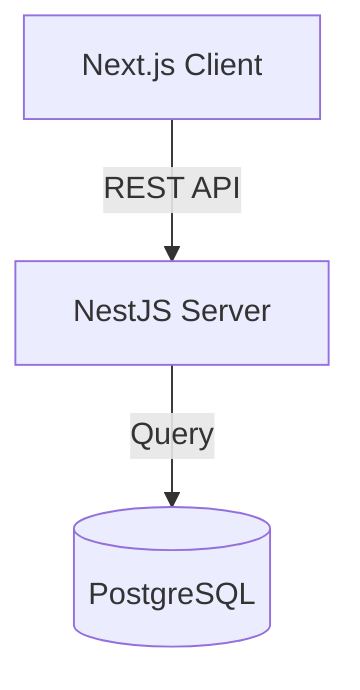

# 구현 계획 - 이커머스 플랫폼

## 목표 설명
아뜨랑스와 유사한 풀스택 쇼핑몰을 구축합니다. 확장성, 성능, 최신 개발 방식을 중점으로 두며, 학습용이지만 실무 수준의 품질을 목표로 합니다.

## 사용자 검토 필요
> [!IMPORTANT]
> 선정된 기술 스택을 확인해 주세요. 최신 웹 개발의 표준적인 도구들을 선정했습니다.

## 제안 아키텍처 및 스택

### 프론트엔드 (Client)
- **프레임워크**: **Next.js 14+** (App Router)
  - 선정 이유: SEO 우수, 서버 사이드 렌더링(SSR), 고성능.
- **언어**: **TypeScript**
  - 선정 이유: 타입 안정성으로 런타임 에러 방지.
- **스타일링**: **Vanilla CSS** (CSS Modules)
  - *참고*: 초기에는 외부 프레임워크 없이 유지보수 가능한 CSS 표준 방식을 따릅니다.
- **상태 관리**: **Zustand** 또는 **Context API**

### 백엔드 (Server)
- **프레임워크**: **NestJS**
  - 선정 이유: Spring Boot와 유사한 견고한 아키텍처(모듈, 컨트롤러, 서비스) 제공, 확장성 및 유지보수 용이.
- **언어**: **TypeScript**
- **API 스타일**: **RESTful API** (표준)

### 데이터베이스
- **데이터베이스**: **PostgreSQL**
  - 선정 이유: 신뢰성 높고 강력한 관계형 데이터베이스.
- **ORM**: **Prisma**
  - 선정 이유: 최고의 개발자 경험, 타입 안전한 데이터베이스 쿼리.

### 인프라
- **컨테이너화**: **Docker** (로컬 개발용 Compose)
- **버전 관리**: Git

## 아키텍처 다이어그램

## 다음 단계: 아뜨배송 (총알 배송) 시스템 구현

### [Goal Description]
아뜨랑스의 핵심 차별화 기능인 "아뜨배송"을 구현합니다. 오후 9시 이전 주문 시 익일 도착을 보장하는 시스템으로, 고객의 구매 전환율을 높이는 것이 목표입니다.

### User Review Required
> [!IMPORTANT]
> **DB 스키마 변경**: `Product` 모델에 `isAttrangsDelivery` (아뜨배송 여부) 필드가 추가됩니다.

### Proposed Changes

#### [Database]
- **Schema**: `Product` 테이블에 `isAttrangsDelivery` (Boolean) 필드 추가.

#### [Backend] (Server)
- **ProductsService**:
  - 상품 조회 시 현재 시간 기준으로 "오늘 출발" 가능한지 계산하는 로직 추가.
  - 마감 시간(오후 9시)까지 남은 시간을 계산하여 반환.

#### [Frontend] (Client)
- **Product Detail Page**:
  - "아뜨배송" 태그 및 아이콘 표시.
  - **카운트다운 타이머**: "오늘 출발까지 03:21:55 남았습니다!" 실시간 표시.
  - 배송 예정일 안내: "내일(수) 도착 예정"

### Verification Plan
- **Manual**:
  - 관리자 페이지에서 상품의 '아뜨배송' 설정 활성화.
  - 상세 페이지에서 카운트다운 타이머 동작 확인.
  - 오후 9시 이후에는 "내일 출발"로 문구 변경 확인.
